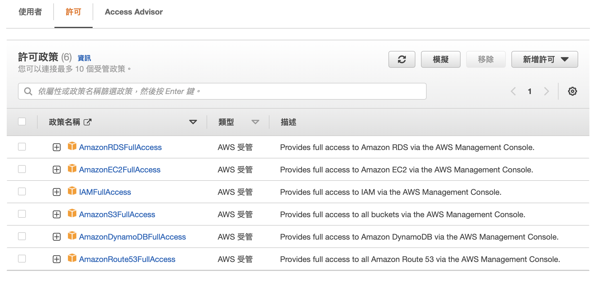

# 為何要學Terraform? 

Terraform 主要為新一代的 infrastructure 管理工具，過去不管是管理 Data Center 或者是 Cloud 都是透過人工的方式去點選出期望的設定值，而人工處理往往會導致各種問題發生，Terraform 就是為了解決這些問題而生。

1. 系統維運的痛點

- 多環境不易維護，要重複做同一件事，能接受嗎？
- 環境一致性，到Dev正常，上到Production卻壞掉了？！
- 人員的狀態、異動、嚴謹度等，掌握不住的都在人。

2. Terraform 帶來的好處

 - 跨平台特性
 - 高度自動化
 - 環境一致性(用程式控制)
 - 稽核與軌跡
 - 自動化測試
 ---

## 學習步驟
---
**Table *of* Contents**

1. [如何開始](#如和開始)

### 如何開始
---

1. [安裝Terraform](#https://developer.hashicorp.com/terraform/tutorials/aws-get-started/install-cli#install-terraform) 
2. [安裝 AWS 指令](#https://aws.amazon.com/tw/cli/)
3. [設定 AWS IAM 權限](#設定-aws-iam-權限)
4. 

#### 設定 AWS IAM 權限
---

- 移動到IAM/使用者群組
- 